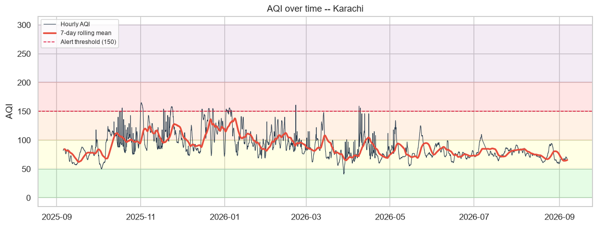
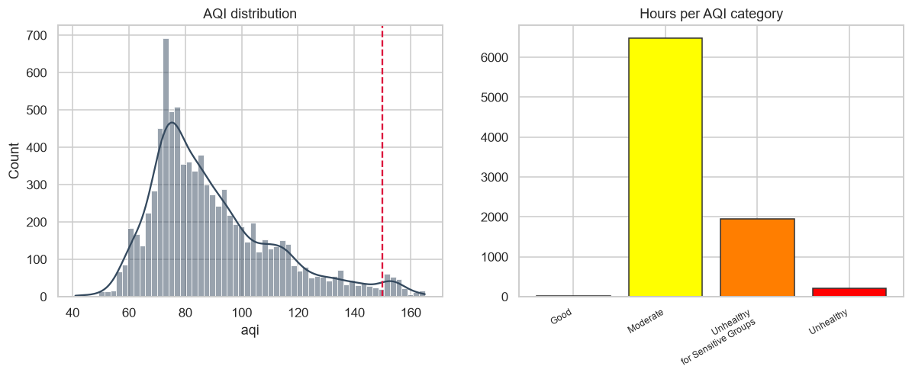
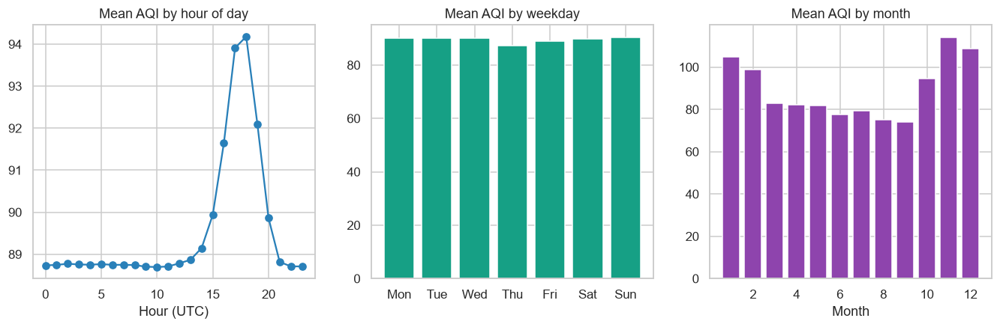
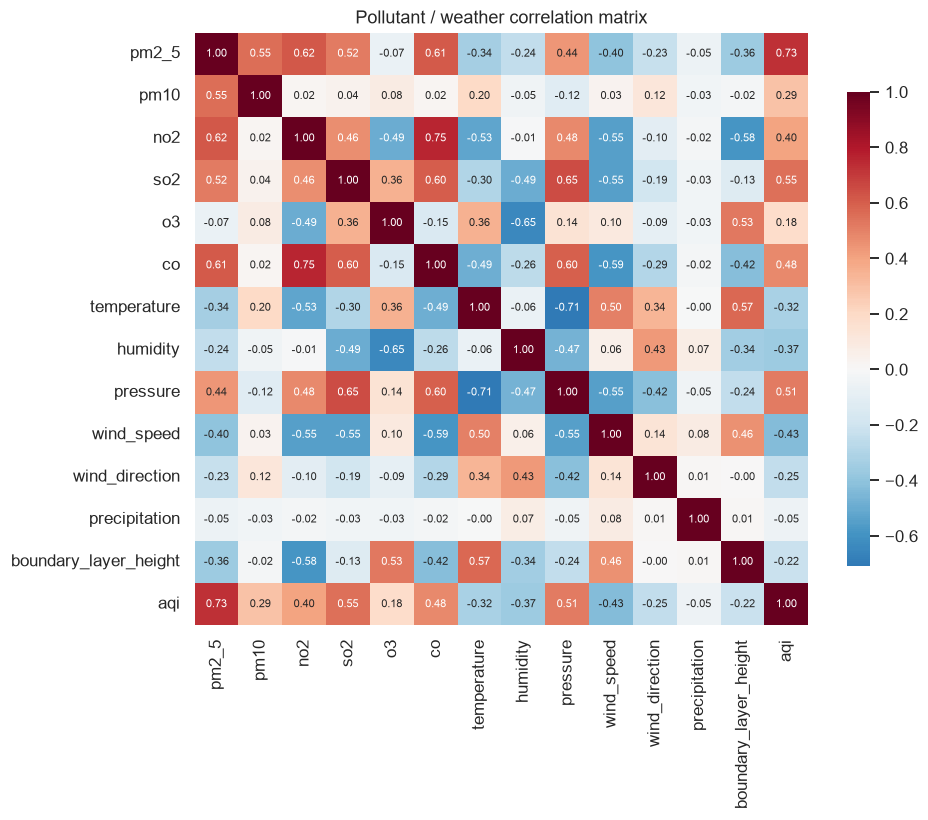
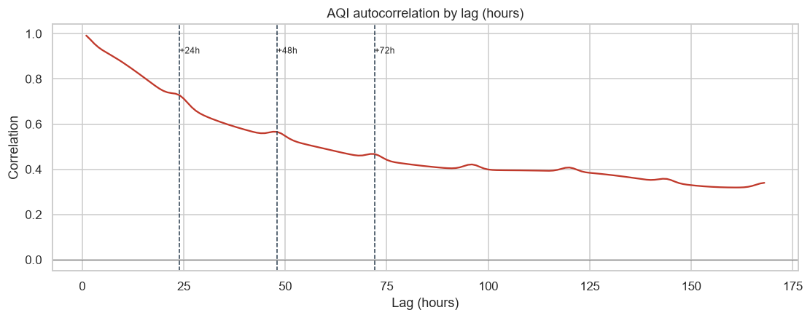
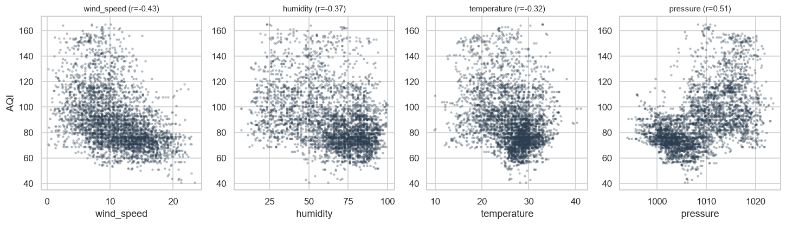
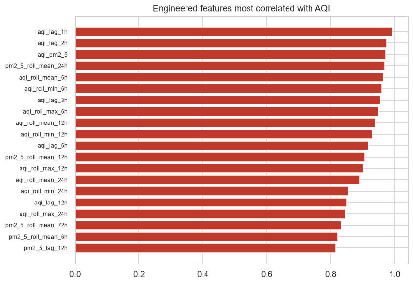

# Exploratory Data Analysis -- Karachi AQI

_Generated 2026-09-06 18:18 UTC from 8,672 hourly
observations spanning 366.0 days (2025-09-05 to 2026-09-06,
98.7% hourly coverage)._

## 1. Air quality profile

| Statistic | Value |
| --- | --- |
| Mean AQI | 89.6 |
| Median AQI | 84.0 |
| Std. deviation | 22.3 |
| 95th percentile | 137.0 |
| Range | 41.0 -- 165.0 |
| Hours at or above the alert threshold (150) | 229 (2.6%) |
| Most frequent dominant pollutant | `pm2_5` |
| Missing raw pollutant readings | 0.0% |

The distribution is right-skewed: typical conditions sit near the median of
84.0, but the tail reaches 165.0. That skew is why the
neural networks are trained with a Huber loss rather than MSE -- the rare severe
episodes are exactly the ones a forecast needs to get right, and a squared loss
lets them dominate the gradient.

## 2. Temporal structure

* **Daily cycle.** AQI peaks around **18:00 local**
  (94.2) and bottoms out at **10:00 local**
  (88.7) -- a swing of
  5.5 AQI points. Hour-of-day is
  therefore encoded cyclically (sin/cos) so that 23:00 and 00:00 sit next to each
  other in feature space.
* **Weekly cycle.** Sunday is the worst day on average,
  consistent with a traffic-driven component.
* **Seasonal cycle.** November is the dirtiest month
  (114.2) and September the cleanest.

## 3. Autocorrelation -- the case for the lag window

| Lag | Autocorrelation |
| --- | --- |
| 1 h | 0.992 |
| 3 h | 0.955 |
| 12 h | 0.848 |
| 24 h | 0.727 |
| 48 h | 0.566 |
| 72 h | 0.468 |
| 168 h | 0.340 |

Correlation stays materially above zero out to 72 hours, and there is a local
bump at 24 h from the daily cycle. Both observations are baked directly into the
feature set: lags at 1/2/3/6/12/24/48/72 h, plus rolling statistics over the same
windows. Beyond ~72 h the signal decays into noise, which is also the honest
limit of this forecast -- accuracy at +72 h is meaningfully worse than at +24 h,
and the dashboard shows that widening uncertainty band rather than hiding it.

## 4. Meteorological drivers

| Variable | Correlation with AQI |
| --- | --- |
| `pm2_5` | +0.728 |
| `so2` | +0.546 |
| `pressure` | +0.514 |
| `co` | +0.484 |
| `wind_speed` | -0.433 |
| `no2` | +0.404 |
| `humidity` | -0.368 |
| `temperature` | -0.322 |

Wind speed is the dominant meteorological control: stagnant air traps
particulates near the surface. That relationship motivates the `stagnation`
(1 / (1 + wind speed)) and `wind_u` / `wind_v` features -- decomposing wind into
vector components lets the tree models learn direction-specific effects, which a
raw 0-360 degree column cannot express because 359 and 1 are far apart
numerically but adjacent physically.

## 5. What this means for modelling

1. **Lag features carry most of the signal**, so a persistence baseline is
   genuinely hard to beat at +24 h. Every candidate is scored against it and the
   training pipeline flags any model that fails to clear it.
2. **The chronological split is mandatory.** With lag features this dense, a
   random split leaks future information and inflates R2.
3. **Direct multi-horizon beats recursive.** Separate heads for +24/48/72 h avoid
   compounding one-step error across three days.
4. **Skew argues for robust losses and tree ensembles**, which is what the
   comparison table generally bears out.

## 6. Figures

